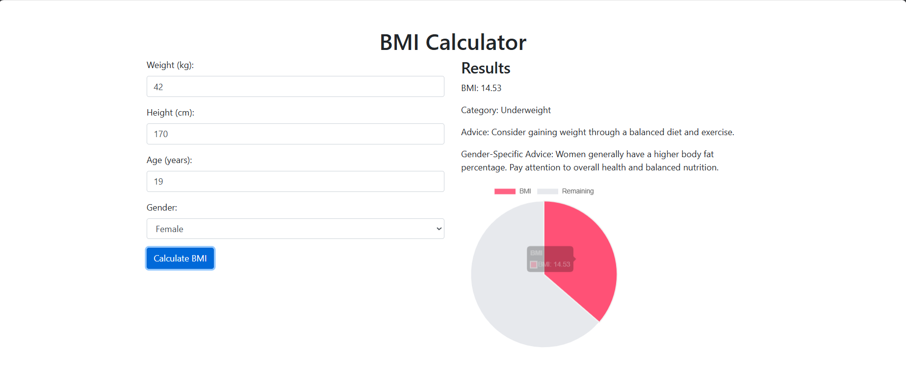

# BMI Calculator

## Project Description

The BMI Calculator is a web application designed to help users quickly calculate their Body Mass Index (BMI) and interpret their results based on weight, height, age, and gender. This project aims to provide a user-friendly interface with dynamic visualizations, including textual results and pie charts, to give a comprehensive view of the user's BMI and its implications.

## Features

- **BMI Calculation**: Users can input their weight, height, age, and gender to calculate their BMI using the standard formula: BMI = weight (kg) / (height (m))^2.
  
- **Textual Results**: The application displays the calculated BMI value along with its corresponding category (Underweight, Normal weight, Overweight, or Obesity) and offers general advice based on the result.

- **Age-Based Advice**: Additional recommendations are provided based on the user's age, acknowledging the specific health considerations for children, adults, and older adults.

- **Gender-Specific Advice**: Tailored advice is given based on the user's gender to address different physiological characteristics and health considerations.

- **Visual Representation**: A pie chart visualizes the BMI data, showing the proportion of BMI compared to a predefined value, offering a clear and engaging way to understand the results.

## Technical Details

- **HTML**: The structure of the web application, including forms and result displays.
- **CSS (Bootstrap)**: Utilized for styling the application and ensuring a responsive design.
- **JavaScript**: Handles the logic for BMI calculation, result display, and dynamic updates of the pie chart using Chart.js.

## Future Enhancements

- **Additional Metrics**: Include more metrics and parameters such as body fat percentage and muscle mass for a more comprehensive health assessment.
- **User Accounts**: Implement user accounts to save and track BMI calculations over time.
- **Mobile Application**: Develop a mobile version of the application for easier access on smartphones.
